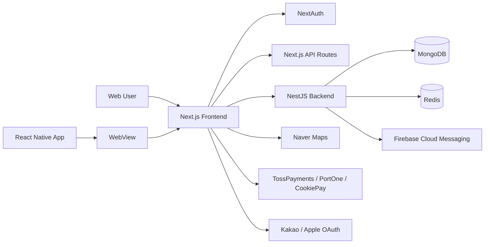

# ABOUT Frontend

> 대학생·취업 전 20대의 공부, 취미, 친목 활동을 하나의 커뮤니티 안에서 연결하는 **ABOUT 웹 프론트엔드**입니다.

본 저장소는 실제 운영 중인 ABOUT 웹 서비스와 카공지도 웹 화면을 포함합니다.  
웹 브라우저뿐 아니라 React Native 앱의 WebView에서도 동일한 제품 경험을 제공합니다.

- Web: [about20s.club](https://about20s.club)
- Cafe Map: [카공지도.com](https://카공지도.com)
- Instagram: [@about._.20s](https://www.instagram.com/about._.20s)
- Backend: [AboutClan/nest-back](https://github.com/AboutClan/nest-back)
- React Native App: [AboutClan/app](https://github.com/AboutClan/app)

---

## Service Overview

ABOUT은 대학생과 취업 전 20대가 원하는 순간에 공부·취미·문화생활을 함께할 사람과 활동을 찾을 수 있도록 만든 커뮤니티 서비스입니다.

사용자의 활동 흐름을 하나의 웹·앱 서비스 안에서 연결합니다.

```text
유입
→ 가입·본인인증·결제
→ 모임·소모임·스터디 탐색
→ 신청·승인
→ 참여·출석
→ 후기·신뢰 데이터 축적
→ 재참여
```

### 주요 운영 지표

2026년 7월 기준입니다.

| 지표 | 값 |
| --- | ---: |
| 누적 가입자 | 8,000명 |
| 누적 유료 가입자 | 5,000명 |
| 월간 활동 인원 | 600명 |
| 월간 모임 | 100회 |
| 카공지도의 등록 장소 | 약 1,000곳 |
| 카공지도의 평시 하루 평균 방문자 | 약 4,000명 |
| 카공지도의 하루 최대 방문자 | 약 25,000명 |
| 웹 저장소 전체 커밋 | 약 5,000건 |

---

## Core Features

### 회원가입·인증

- 카카오·애플 소셜 로그인
- NextAuth 기반 세션 관리
- NICE 휴대폰 본인인증
- 20대 연령 확인 및 중복 가입 방지
- 다단계 회원가입 온보딩
- 게스트 세션과 정식 회원 전환
- 웹·앱·외부 브라우저 간 인증 복귀 처리
- 관리자 가입 승인 연동

### 모임

- 모임 탐색·상세 조회
- 다단계 모임 개설·수정
- 무료·유료 참여 신청
- 승인 대기, 승인·거절·추방
- 초대 링크 및 카카오 공유
- 취소 시점별 참여권·포인트 처리
- 활동 종료 후 보증금·노쇼 자동 정산
- 참여 후기와 피드

### 소모임

- 카테고리·상태별 무한스크롤 탐색
- 자유가입·승인제 가입
- 소모임 개설 및 운영진 관리
- 정규·임시 멤버 구분
- 멤버 역할·활동 상태·추방 관리
- 공지·게시글·일정
- 월간 참여권·포인트 자동 정산
- 매너평가와 활동 종합 지표

### 스터디 자동 매칭

- 위치·시간대 투표
- 좌표 기반 스터디 자동 매칭
- 최소 공통 참여 시간 확인
- Haversine 거리 계산과 DBSCAN 기반 그룹 분할
- 중복 매칭 방지
- 도착 인증·지각·불참 처리
- 출석률에 따른 자동 취소와 페널티
- 신규 스터디 장소 제보 및 관리자 승인

### 신뢰·평판

- 실명 인증 기반 프로필
- 활동 이력과 후기
- 매너온도
- 익명·실명 후기
- 신고, 거리두기, 차단
- 단계형 이용 제한
- 활동 전 상대방의 신뢰 정보 확인

### 커뮤니티·채팅

- 익명·실명 게시글
- 이미지 업로드
- 게시글 투표
- 좋아요
- 댓글·대댓글
- 1:1 채팅
- 신고·차단 연동
- React Query 폴링 기반 준실시간 동기화

### 포인트·참여권·결제

- 포인트 잔액과 원장 조회
- 모임·소모임 참여권
- 포인트 충전
- 포인트 상점과 경품 응모
- 등급·뱃지·랭킹
- 가입비 결제
- TossPayments·PortOne·쿠키페이 연동
- 결제 성공·실패 리다이렉트
- 외부 결제 앱 실행과 서비스 복귀
- 결제 검증, 중복 지급 방지, 미지급 복구

### 카공지도

- 현재 위치 기반 카페 지도 탐색
- 약 1,000개 장소 데이터
- 콘센트·좌석·분위기·와이파이 등 목적별 필터
- 지도 이동·줌에 따른 조회 범위 조정
- 장소 상세 정보와 편의시설
- 실사용자 리뷰·평점
- 신규 카페 제보
- 장소 랭킹과 피드
- AI 기반 카공 적합도 평가
- 게스트 자동 로그인과 정식 회원 전환

### 관리자·운영 자동화

- 가입·지원금·건의·탈퇴·불참·장소 추가 신청함
- 회원·역할·포인트·참여권 관리
- 공지·뱃지·티켓 지급
- 데이터 정합성 복구·롤백
- 관리자 전용 SSR 접근 제어
- 푸시 발송 테스트
- 운영 데이터 초기화

---

## Frontend Architecture



### 상태 관리 원칙

| 상태 | 담당 |
| --- | --- |
| API 응답·서버 데이터 | React Query |
| 다단계 폼의 임시 입력값 | Recoil |
| 개별 폼 입력·검증 | React Hook Form |
| 로그인 세션 | NextAuth |
| 앱과 웹 간 네이티브 메시지 | WebView Bridge |

모임·소모임 개설과 회원가입처럼 여러 화면을 거치는 입력값은 Recoil로 유지하고, 서버에서 조회한 데이터와 mutation 결과는 React Query로 분리합니다.

---

## Frontend Engineering Highlights

### 대규모 지도 렌더링 최적화

약 1,000개의 장소를 한 번에 렌더링하면서 지도 이동과 Drawer 애니메이션이 끊기는 문제가 발생했습니다.

다음 방식으로 렌더링 범위를 줄였습니다.

- 현재 화면과 가까운 장소만 조회·표시
- 지도 이동 중이 아닌 `idle` 시점에 데이터 갱신
- 줌 수준에 따라 조회 반경 조절
- 불필요한 마커 재생성 방지
- 무거운 이미지·리뷰 컴포넌트의 마운트 시점 분리
- 메모이제이션을 통한 부모 컴포넌트 리렌더링 감소

### 웹·앱·외부 브라우저 인증 흐름

카카오 로그인과 본인인증 과정에서 PC 팝업, 모바일 브라우저, iOS Safari, 앱 WebView의 동작이 서로 다릅니다.

- 실행 환경별 callback URL 처리
- 외부 브라우저에서 인증 후 앱 복귀
- 세션 복원과 가입 단계 재진입
- 인증 성공·실패·중단 상태 안내
- React Native 딥링크와 WebView 메시지 연동

### 결제 리다이렉트와 복구

결제 승인과 서비스 내부 지급을 별도 상태로 관리합니다.

- TossPayments 위젯 연동
- PortOne 서버 검증 흐름 연결
- 쿠키페이 결제 결과 처리
- 외부 결제 앱 실행 후 복귀
- 결제 식별자 기준 중복 처리 방지
- 결제 성공 후 포인트·참여권 미지급 주문 복구

### 서버·클라이언트 캐시 조정

소모임 목록은 백엔드 Redis 캐시와 프론트엔드 React Query 캐시를 함께 사용합니다.

- `staleTime`과 재검증 시점 조정
- mutation 이후 필요한 query만 무효화
- 오래된 서버 캐시와 클라이언트 캐시 충돌 방지
- 무한스크롤 요청과 중복 네트워크 호출 최소화

### 역할 기반 접근 제어

관리자 페이지는 클라이언트에서 메뉴만 숨기지 않고, `getServerSideProps` 단계에서 세션과 역할을 검사해 렌더링 전 접근을 차단합니다.

---

## Tech Stack

| Category | Technologies |
| --- | --- |
| Framework | Next.js 14 Pages Router, React 18, TypeScript |
| UI | Chakra UI, Emotion, styled-components, Framer Motion, Swiper |
| State | React Query v3, Recoil, React Hook Form |
| Authentication | NextAuth, Kakao OAuth, Apple OAuth, NICE 본인인증 |
| Networking | Axios |
| Map | Naver Maps SDK |
| Payment | TossPayments Widget SDK, PortOne Browser SDK, CookiePay |
| Data | MongoDB, Mongoose, Next.js API Routes |
| App Integration | React Native WebView, Deep Link, FCM |
| PWA | next-pwa |
| UI Documentation | Storybook 8, Chromatic |
| Quality | ESLint, Prettier, TypeScript |
| Deployment | Docker, AWS CodeBuild, ECR, CodeDeploy, EC2, Secrets Manager |

---

## Project Structure

```text
.
├── pages/                 # Pages Router 기반 라우트
│   ├── admin/             # 관리자 화면
│   ├── api/               # NextAuth·결제·외부 API 프록시
│   ├── cafe-map/          # 카공지도
│   ├── gather/            # 모임
│   ├── group/             # 소모임
│   ├── study/             # 스터디
│   ├── community/         # 커뮤니티
│   ├── profile/           # 프로필·마이페이지
│   ├── payment/           # 가입비·결제 결과
│   └── register/          # 회원가입 온보딩
├── pageTemplates/         # 페이지 단위 화면 구성과 도메인 UI
├── components/
│   ├── atoms/             # 최소 단위 UI
│   ├── molecules/         # 조합형 UI
│   ├── organisms/         # 도메인 단위 UI
│   ├── layouts/           # 공통 레이아웃
│   ├── drawers/           # 모바일 Drawer
│   ├── modals/            # 공통 모달
│   └── services/          # 서비스 연동 컴포넌트
├── hooks/                 # 공통·도메인 커스텀 훅
├── recoils/               # 클라이언트 임시 상태
├── models/                # 데이터 모델
├── types/                 # TypeScript 타입
├── libs/                  # 라이브러리 초기화·공통 설정
├── utils/                 # 공통 유틸리티
├── constants/             # 상수와 정책값
├── @natives/              # WebView·네이티브 연동
├── stories/               # Storybook 스토리
├── styles/                # 전역 스타일
├── public/                # 정적 파일
├── theme.ts               # Chakra UI 테마
├── next.config.js         # Next.js·PWA·이미지 설정
├── buildspec.yml          # AWS CodeBuild
├── appspec.yml            # AWS CodeDeploy
└── Dockerfile             # Production 이미지
```

---

## Getting Started

### Requirements

- Node.js `20.11.0`
- npm `10.2.4`

Production Docker 환경은 위 버전을 사용합니다.

### Installation

```bash
git clone https://github.com/AboutClan/About.git
cd About
npm install
```

### Environment Variables

프로젝트 루트에 `.env.local` 파일이 필요합니다.

환경 변수에는 다음 외부 시스템의 설정값이 포함됩니다.

- NextAuth
- Kakao·Apple OAuth
- NestJS Backend API
- Naver Maps
- NICE 본인인증
- TossPayments·PortOne·CookiePay
- MongoDB
- AWS S3
- Firebase

실제 변수명과 값은 내부 환경 설정 문서 또는 운영팀이 관리하는 Secrets Manager를 기준으로 설정합니다. 민감한 키는 저장소에 커밋하지 않습니다.

### Development

현재 `dev` 스크립트는 Windows 명령어 형식으로 작성되어 있습니다.

#### Windows

```bash
npm run dev
```

#### macOS / Linux

```bash
NODE_OPTIONS=--openssl-legacy-provider npx next dev
```

개발 서버는 기본적으로 `http://localhost:3000`에서 실행됩니다.

### Production Build

```bash
npm run build
npm start
```

### Storybook

```bash
npm run storybook
```

---

## Deployment

Production 배포는 다음 흐름으로 구성되어 있습니다.

```text
AWS Secrets Manager
→ CodeBuild에서 .env.production 생성
→ Docker 이미지 빌드
→ Amazon ECR 업로드
→ CodeDeploy
→ EC2에서 컨테이너 실행
```

Next.js 서버는 컨테이너 내부 `3000` 포트에서 실행됩니다.

---

## Web & App Integration

ABOUT과 카공지도 앱은 React Native 기반 WebView 셸을 사용합니다.

웹 프론트엔드는 네이티브 앱과 메시지를 주고받으며 다음 기능을 연결합니다.

- 네이티브 공유
- 전화·문자 실행
- 진동·햅틱
- 디바이스 정보
- 외부 링크
- 앱 종료
- 딥링크
- 뒤로가기
- FCM 알림 이동
- 카카오 로그인 복귀
- 외부 결제 앱 복귀

React Native 프로젝트의 초기 설정은 협업으로 진행했으며, 이후 웹·앱 브리지와 기능 연동, 유지보수는 지속적으로 이 저장소와 앱 저장소에서 관리하고 있습니다.

---

## Ownership

이승주가 Founder & Product Engineer로서 다음 범위를 주도했습니다.

- 서비스 기획과 기능 우선순위 결정
- UX/UI 디자인
- 웹 프론트엔드 전체 개발
- 백엔드 서비스 기능 개발·확장
- PWA 직접 기획·개발
- React Native 전환 기획
- 웹·앱 브리지와 인증·결제 복귀 연동
- 배포와 운영
- 관리자 도구와 운영 자동화
- 사용자 피드백과 지표 기반 반복 개선

초기 백엔드 기반 구조는 백엔드 개발자와 협업했으며, 제품 기능과 프론트엔드 전반은 이승주가 주도적으로 개발·운영하고 있습니다.

---

## Related Repositories

| Repository | Description |
| --- | --- |
| [AboutClan/About](https://github.com/AboutClan/About) | Next.js 웹 프론트엔드 |
| [AboutClan/nest-back](https://github.com/AboutClan/nest-back) | NestJS 백엔드 |
| [AboutClan/app](https://github.com/AboutClan/app) | React Native 앱 |

